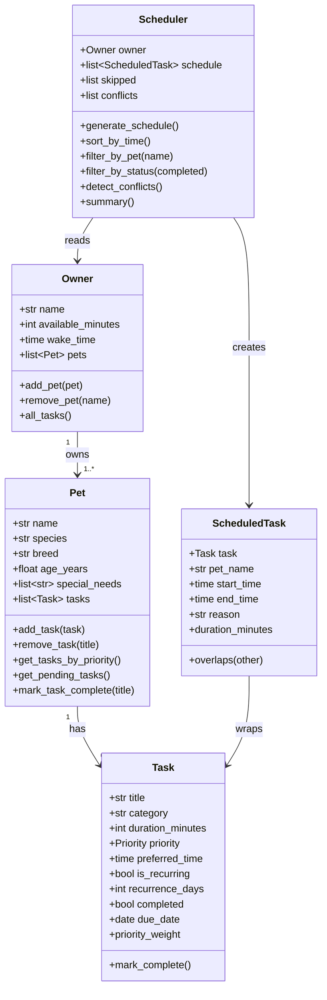
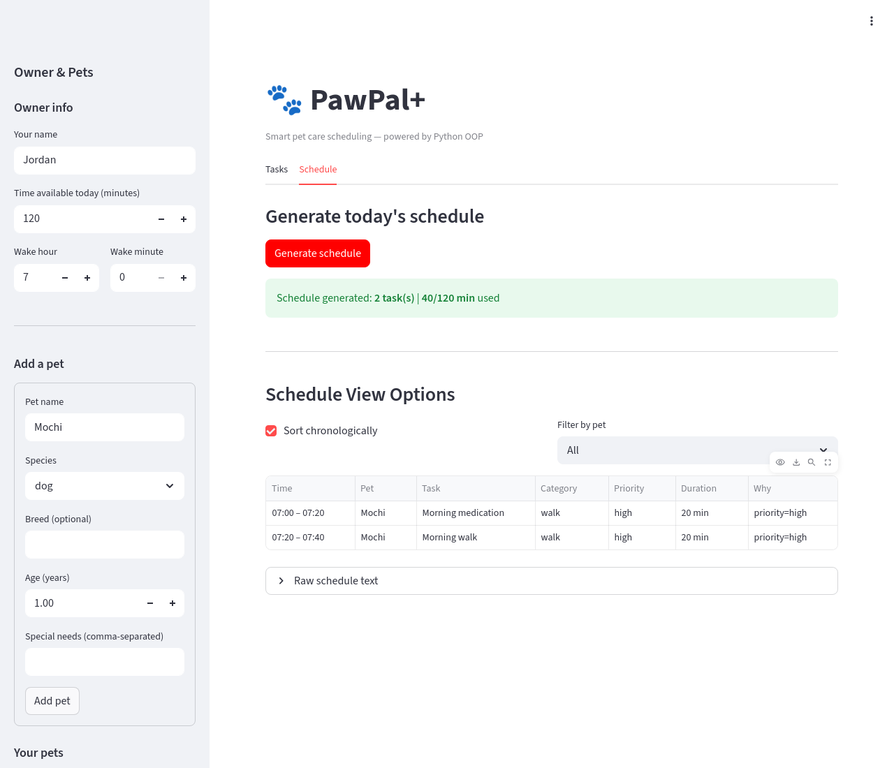

# PawPal+ (Module 2 Project)

A **Streamlit pet-care scheduling app** built with Python OOP. PawPal+ helps a busy owner plan and track daily care tasks for one or more pets — intelligently sorting, prioritising, and fitting everything into the day's available time.

---

## Scenario

A busy pet owner needs help staying consistent with pet care. They want an assistant that can:

- Track pet care tasks (walks, feeding, meds, enrichment, grooming, etc.)
- Consider constraints (time available, priority, preferred timing)
- Produce a daily plan and explain why it chose that plan

---

## System Architecture (UML)



---

## 📸 Demo



## Features

### Core scheduling
- **Priority-first ordering** — `high` tasks are always scheduled before `medium` and `low` ones.
- **Preferred-time honouring** — tasks with a set preferred time are delayed until that slot; the scheduler never moves the clock backwards.
- **Daily time budget** — tasks that would exceed `available_minutes` are skipped gracefully and listed separately with a reason.

### Smarter scheduling
- **Sorting by time** — `Scheduler.sort_by_time()` returns the schedule in chronological order regardless of insertion order.
- **Filtering** — `filter_by_pet(name)` and `filter_by_status(completed)` let the UI show subsets of the plan.
- **Recurring task automation** — calling `Task.mark_complete()` (or `Pet.mark_task_complete()`) on a recurring task automatically creates the next occurrence with the correct `due_date` (today + `recurrence_days`).
- **Conflict detection** — `Scheduler.detect_conflicts()` scans the schedule for overlapping time blocks and returns a list of conflicting pairs.

### Explainability
- Every `ScheduledTask` carries a `reason` field describing *why* it was placed at its start time (e.g., "priority=high, delayed to preferred time 07:30").

---

## Getting started

```bash
python -m venv .venv
source .venv/bin/activate      # Windows: .venv\Scripts\activate
pip install -r requirements.txt
```

### Run the Streamlit app

```bash
streamlit run app.py
```

### Run the CLI demo

```bash
python main.py
```

### Run the test suite

```bash
python -m pytest tests/ -v
```

---

## Testing PawPal+

The automated suite lives in `tests/test_pawpal.py` and covers **37 test cases** across five test classes:

| Class | What is tested |
|---|---|
| `TestTask` | Priority normalisation, weight values, category auto-fill, explicit duration preservation, `mark_complete()` for one-off and recurring tasks |
| `TestPet` | `add_task`, `remove_task`, priority sorting, `get_pending_tasks`, `mark_task_complete` with recurrence |
| `TestOwner` | `add_pet`, `remove_pet`, `all_tasks` flat-merge |
| `TestScheduler` | Priority ordering, chronological sort, budget enforcement, preferred-time honouring, no-time-travel, recurrence date calculation, conflict detection, per-pet filtering |
| `TestScheduledTaskOverlap` | Back-to-back (no overlap), partial overlap, contained interval, symmetry |

**Confidence level: ★★★★☆**

The happy path and all core edge cases are covered. Cases left for future work: midnight wrap-around, multi-week recurrence, and two pets competing for the exact same preferred slot.

---

## Project structure

```
pawpal_system.py   ← backend logic (Owner, Pet, Task, Scheduler, ScheduledTask)
app.py             ← Streamlit UI
main.py            ← CLI demo / manual test harness
tests/
  test_pawpal.py   ← pytest suite (37 tests)
reflection.md      ← design, tradeoff, and AI-collaboration reflection
requirements.txt
```

---

## AI collaboration note

This project was scaffolded with AI assistance (Claude). Key moments where human judgment was applied:

- The AI initially overrode explicit task durations with category defaults; a targeted test (`test_explicit_duration_not_overridden`) caught the bug and the fix required a one-line conditional.
- The AI suggested returning plain dicts from `generate_schedule`; I replaced that with a proper `ScheduledTask` dataclass to keep the `overlaps()` logic encapsulated.

See `reflection.md` for a full account.
